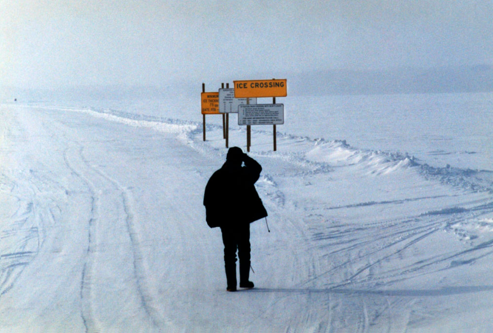
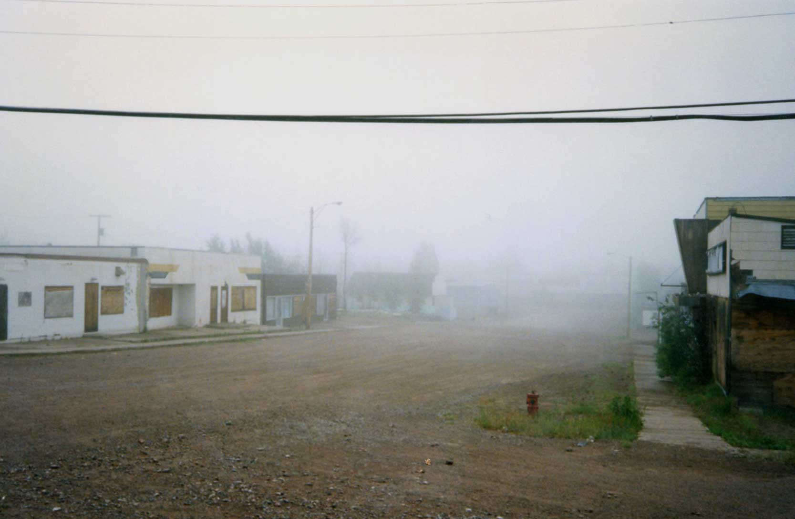

<!-- 
Links: [Link text Here](https://link-url-here.org)

 -->

<!-- ## Updating the Uranium City History website -->

The website [Uranium City History]('https://uraniumcity-history.com') is the second site I built on my own (the first being my original portfolio site, built on Wordpress). I built it on Wordpress, which was a good choice at the time - Wordpress was at the height of its popularity pre-Gutenberg, and it had all the qualities of a CMS I needed to easily add and update content. 

The project was an outgrowth of my own attempt to make a documentary about Uranium City, Saskatchewan. I'd grown up in Uranium City in the '70s and early '80s, not long before its last mine abruptly closed in 1982, cutting the town's population by 90% in just a few months. 

I worked in the documentary TV industry but I'd never made my own documentary, beyond cutting some footage I shot on a video camera (this was looong before the ubiquitou cell phone video we see now) into a semi-coherent narrative. I teamed up with an experienced director, raised some money from various Canadian film and TV networks, and headed north to shoot what we hoped would become a test reel. 

In February. In a cold snap. 

We stayed ten days, shot in a largely empty town in 35 below, got some great footage but . . . were never able to make the film. The footage, and all the research I'd gathered for the project, sat in my closet. 

Then, ten years later, I began developing websites. And decided to set up a website about the town. 

There'd been a previous website at `uraniumcity.org` set up by a former resident, who'd been in Uranium City from the '50s, when the town was first built around what had been a caribou trail. It was a classic late '90s hobbyist site, with a dancing gif, basic text and a few photos. But it served what seemed like a then miraculous purpose of connecting people who hadn't been in touch for decades, and providing a central hub. After Uranium City's last mine closed in 1982, its resident moved all over Canada, and mostly fell out of touch. There was a reunion every few years in Saskatchewan, but it was only attended by few core ex-residents who still lived in the area. The larger community were barely aware of each other's existence. The website changed all that. At a reunion in 2002, which I attended, nearly 800 former residents showed up. 

I contributed a couple of articles to the site about the town, and ended up corresponding with former residents all across the globe - the range of people who'd lived in Uranium City and still had memories of the town, was astounding. Alas, in that pre-cloud era, my computer crashed and the Apple tech I took it to managed to wipe out the entire hard drive. Thus disappeared 2-3 years of correspondence, and the stories that went with them. 

By the early '00s, the `uraniumcity.org` site wasn't being updated much, and was actually starting to fall apart. My good friend Ian Rawes ([sadly recently deceased](find ES obit)) had set up the [London Sound Survey](https://londonsoundsurvey.org) and I was just starting out as a web developer, building simple Wordpress sites. 

So I built this site, hoping I'd generate the energy I had emailing people from across the globe, but in real time, in public. I saw as a repository of stories, collected and archived, along with photographs from both residents and visitors of the town in past and present. 

Unfortunately, by that point Facebook groups had become a thing, and sure enough there was a 'Friends of Uranium City' group, which rapidly grew to over a thousand, then two thousand people (check stats). Friends I hadn't seen in decades were suddenly right there, on my feed. But as the original website holder warned me "You'll find much of the energy that used to go to my site has gone to social media."

And he was right. The FB group hoovered up the photos, stories, memorabilia and commentary I thought would go to my site. I still did manage to accumulate a lot of content, including hundreds of comments, and when I decided to update the website, I knew it meant turning the original Wordpress site into so-called **Headless Wordpress** and building the front end on a javascript framework. 

